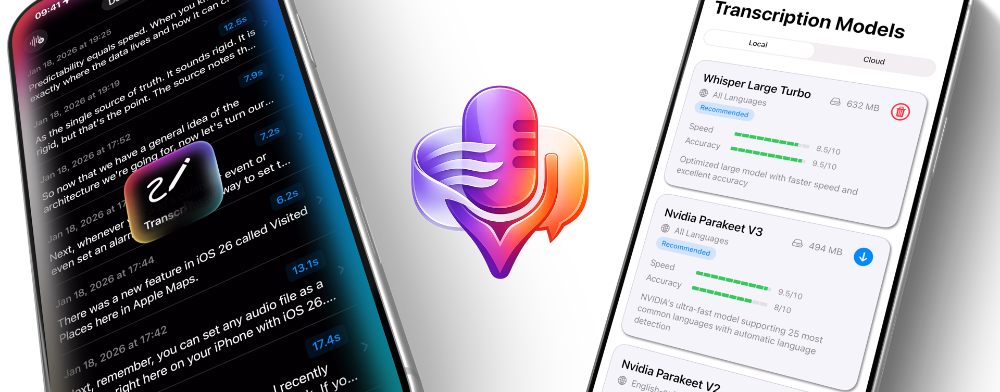
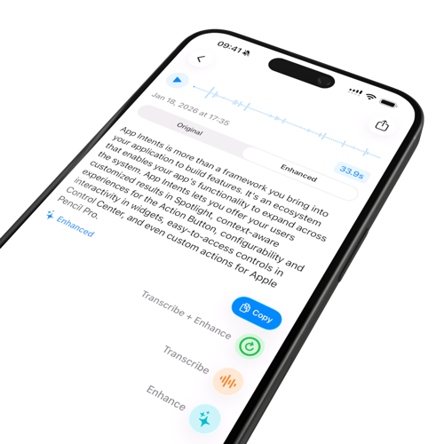
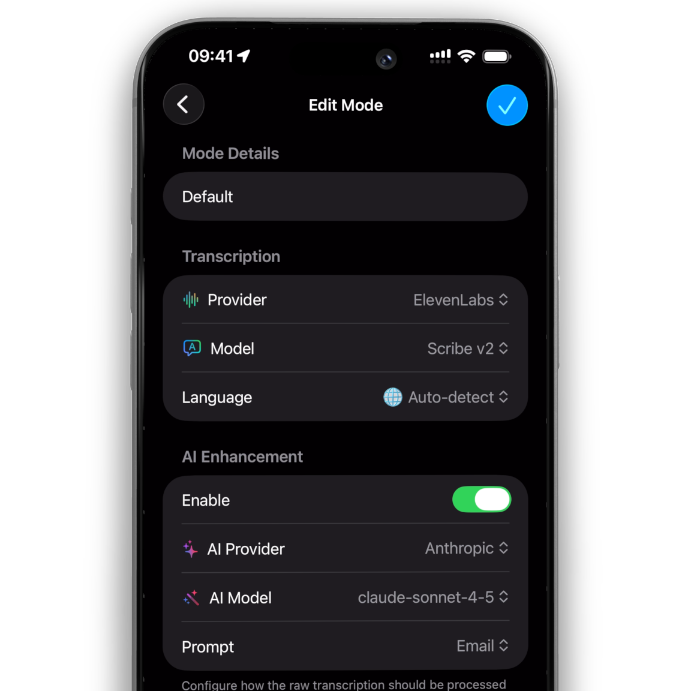
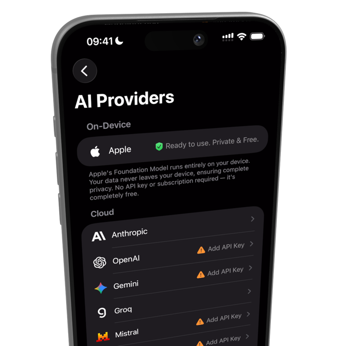
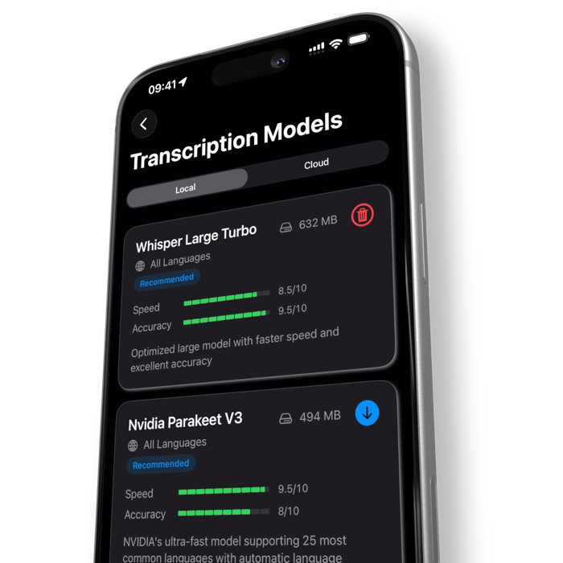
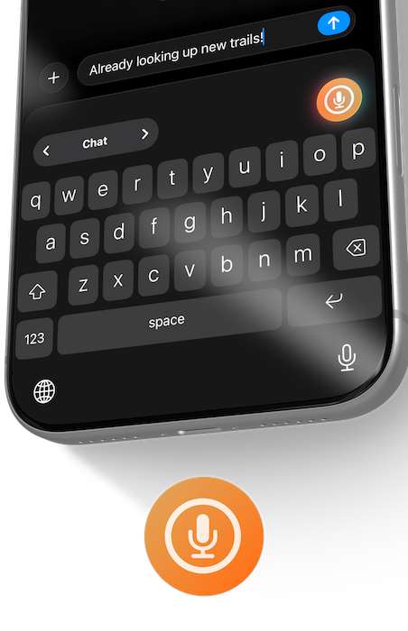
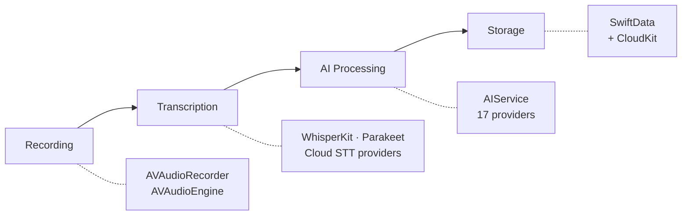
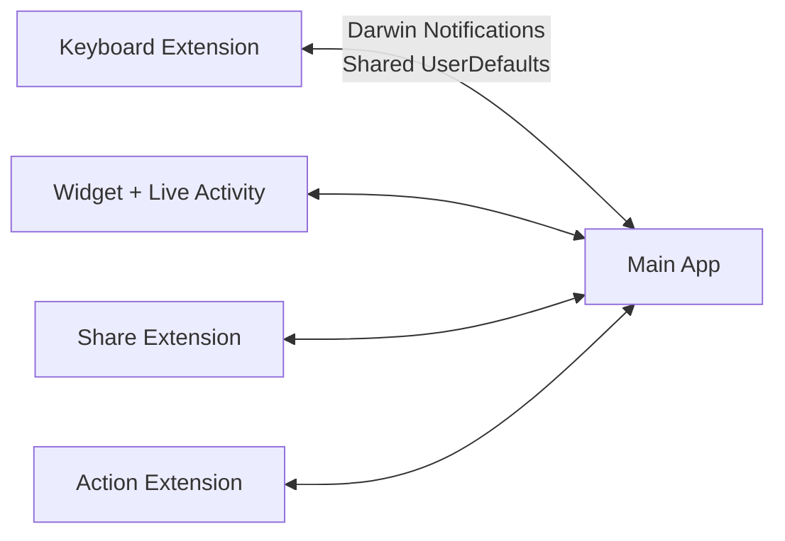

<p align="center">
  
</p>

<h1 align="center">VivaDicta</h1>

<p align="center">
  iOS voice-to-text app with AI voice keyboard — dictate into any app, powered by Apple Foundation Models, WhisperKit, NVIDIA Parakeet, and 15+ AI providers
  <br>
  <a href="https://vivadicta.com/ios">Website</a> &bull;
  <a href="https://apps.apple.com/app/id6758147238">App Store</a> &bull;
  <a href="documentation/README.md">Documentation</a>
</p>

<p align="center">
  
  
  
  
</p>

---

<p align="center">
  
</p>

> Started as "I don't want to pay for WisprFlow." Ended up building something more flexible — on-device transcription, 15+ AI providers, OAuth sign-in, CLI agent bridge, and full control over your voice-to-text pipeline.

VivaDicta records speech, transcribes it using on-device or cloud models, and optionally processes the text through an AI provider — including Apple Foundation Models for free, fully on-device AI. Its key feature is a **system-wide AI voice keyboard** that lets you dictate and AI-process text directly into any app — Messages, WhatsApp, Slack, email, or anything else. The keyboard can also **rewrite existing text in any app** — select text, apply an AI preset, and get the result in place. Sign in with your ChatGPT, Gemini, or GitHub Copilot account via OAuth, or route AI through CLI agents on your Mac with VivAgents. Supports 10+ transcription providers, 15+ AI providers, and syncs across devices (iOS/iPadOS/macOS) via CloudKit.

## Screenshots

<p align="center">
  
  &nbsp;&nbsp;
  
  &nbsp;&nbsp;
</p>

<p align="center">
  
  &nbsp;&nbsp;
  
</p>

## Features

**Transcription**
- On-device: WhisperKit (OpenAI Whisper), Parakeet (NVIDIA) — professional-grade models running entirely on your device
- Cloud: OpenAI, Groq, Deepgram, ElevenLabs, Gemini, Mistral, Soniox, or any OpenAI-compatible endpoint
- 100+ languages with automatic detection
- Filler word removal, paragraph formatting, custom word replacements

**AI Presets**
- 43 built-in presets across categories: Rewrite, Style, Communication, Summarize, Social Media, Writing, Learn & Study, Translate (11 languages)
- **AI Assistant** — ask questions, fact-check, explain, reformat, or give instructions by voice
- **Auto-Translation** — speak in one language, get output in another
- Each result saved as a variation — compare different AI outputs side by side
- Create custom presets with full prompt control, mark favorites for quick access

**AI Providers**
- 15+ providers: Apple Foundation Model (on-device, free), Anthropic, OpenAI, Gemini, GitHub Copilot, Groq, Mistral, Cerebras, Grok, OpenRouter, Vercel AI Gateway, HuggingFace, Ollama, and more
- **OAuth sign-in** for ChatGPT, Gemini, and GitHub Copilot — use your existing subscription, no API keys needed
- Bring your own AI via any OpenAI-compatible API endpoint

**VivAgents — CLI Agent Bridge**
- Route AI processing through CLI agents (Claude Code, Codex, Gemini CLI) running on your Mac or a remote server
- Use your existing CLI subscriptions instead of separate API keys
- Per-agent toggles, health monitoring, and automatic fallback to API keys if the server is unavailable

**VivaModes**
- Configurable profiles combining transcription provider, AI provider, model, preset, and language
- Each mode remembers its settings — switch contexts with one tap
- Clipboard context — AI uses copied text as context when processing your dictation (e.g., copy a message, then dictate your reply)

**Custom AI Voice Keyboard**
<p>

</p>

- System-wide voice keyboard — dictate into Messages, WhatsApp, Email, Notion, Slack, or any app
- Full transcription + AI processing pipeline right from the keyboard
- **AI text processing in any app** — select existing text in any app and rewrite, summarize, translate, or apply any preset without leaving it. The keyboard reads the text, sends it to the main app for AI processing via IPC, and replaces it in place
- Swipe to switch between modes without leaving the app you're typing in

**Personalization**
- Custom dictionary for names and terms (OpenClaw, Dr. Johnson, etc.)
- Word replacements and shortcuts (e.g., "my email" → support@vivadicta.com)
- Audio recordings saved alongside transcriptions

**Sync & Extensions**
- iCloud sync across iPhone, iPad, and Mac — transcriptions, presets, custom dictionary, and API keys
- Home and Lock screen widgets and Control Center control to quickly record a note
- Live Activity for recording status
- Share Extension and Action Extension for importing audio files from other apps

## Key Technical Highlights

- Apple Foundation Models for free, private on-device AI processing
- On-device STT via WhisperKit and NVIDIA Parakeet (CoreML / Apple Neural Engine)
- Swift 6 with strict concurrency
- SwiftUI + Liquid Glass
- SwiftData with CloudKit sync
- Cross-process IPC using Darwin Notifications between 5 targets
- 7-stage text processing pipeline with customizable transforms
- App Intents — Siri and Shortcuts integration
- CoreSpotlight — indexed transcriptions for iOS spotlight search
- OAuth 2.0 with PKCE via local server bridge (NWListener) for ChatGPT, Gemini, and GitHub Copilot
- VivAgents client for routing AI through CLI agents on Mac/remote server
- iCloud Keychain for secure cross-device API key sync

## Architecture



Main app ↔ extensions IPC via `AppGroupCoordinator` (Darwin Notifications + Shared UserDefaults):



Core components:

| Component | Role |
|-----------|------|
| `AppGroupCoordinator` | Cross-process communication using Darwin Notifications (custom keyboard, widgets, share, action extensions) |
| `RecordViewModel` | Recording lifecycle, dual audio paths (normal + keyboard prewarm) |
| `TranscriptionManager` | Routes to on-device or cloud STT, post-processing pipeline |
| `AIService` | AI text processing, 15+ providers, OAuth, VivAgents, mode/API key management |
| `PresetManager` | Built-in + custom presets, CloudKit sync |
| `AudioPrewarmManager` | Continuous audio engine for keyboard extension low-latency recording |

See the [documentation](documentation/README.md) for detailed diagrams and flows.

## Building

**Requirements:**
- Xcode 26+
- iOS 18+ deployment target

```bash
# Clone
git clone https://github.com/n0an/VivaDicta.git
cd VivaDicta

# Open in Xcode
open VivaDicta.xcodeproj

# Or build from command line
xcodebuild build \
  -scheme VivaDicta \
  -workspace ./VivaDicta.xcodeproj/project.xcworkspace \
  -destination generic/platform=iOS \
  CODE_SIGNING_ALLOWED=NO
```

> **Note:** On-device transcription models (WhisperKit, Parakeet) are downloaded on first use. Cloud AI providers work via API keys, OAuth sign-in (ChatGPT, Gemini, Copilot), or VivAgents server connection.

## Project Structure

```
VivaDicta/
├── VivaDicta/              # Main app target
│   ├── Views/              # SwiftUI views + view models
│   ├── Models/             # SwiftData models (Transcription, Preset, etc.)
│   ├── Services/           # Core services
│   │   ├── AIEnhance/      # AIService, providers, prompts
│   │   └── Transcription/  # TranscriptionManager, STT providers
│   ├── Shared/             # AppGroupCoordinator, shared utilities
│   └── VivaDicta.docc/     # DocC documentation catalog
├── VivaDictaKeyboard/      # Custom keyboard extension
├── VivaDictaWidget/        # Widget + Live Activity
├── ShareExtension/         # Share extension
├── ActionExtension/        # Action extension
├── documentation/          # Architecture docs, references
└── .github/workflows/      # CI: build check, Claude review, GitGuardian
```

## Documentation

- **[Documentation](documentation/README.md)** — recording pipeline, transcription system, AI processing, text pipeline, preset system, AppGroupCoordinator
- **[Text Processing Pipeline](documentation/text-processing-pipeline.md)** — 7-stage pipeline from raw audio to formatted text
- **[DocC Reference](https://n0an.github.io/VivaDicta/)** — generated DocC documentation

## Contributing

Contributions are welcome. Please open an issue first to discuss what you'd like to change.

1. Fork the repository
2. Create your feature branch (`git checkout -b feature/my-feature`)
3. Commit your changes
4. Push to the branch (`git push origin feature/my-feature`)
5. Open a Pull Request

The CI will run a build check on your PR automatically.

## License

This project is licensed under the MIT License. See [LICENSE](LICENSE) for details.

---

https://github.com/user-attachments/assets/d22f06b3-78f6-4eaf-9026-f11c0ea7bf57

## Star History

[](https://star-history.com/#n0an/VivaDicta&Date)

---

<p align="center">
  Made with ❤️ by Anton Novoselov
  <br><br>
  <a href="https://twitter.com/_antonnovoselov"></a>
  &nbsp;
  <a href="https://www.linkedin.com/in/anton-novoselov/"></a>
</p>
