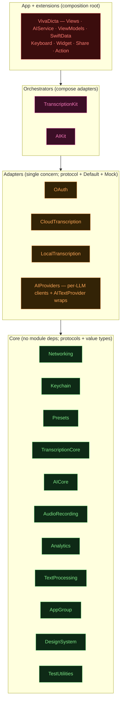
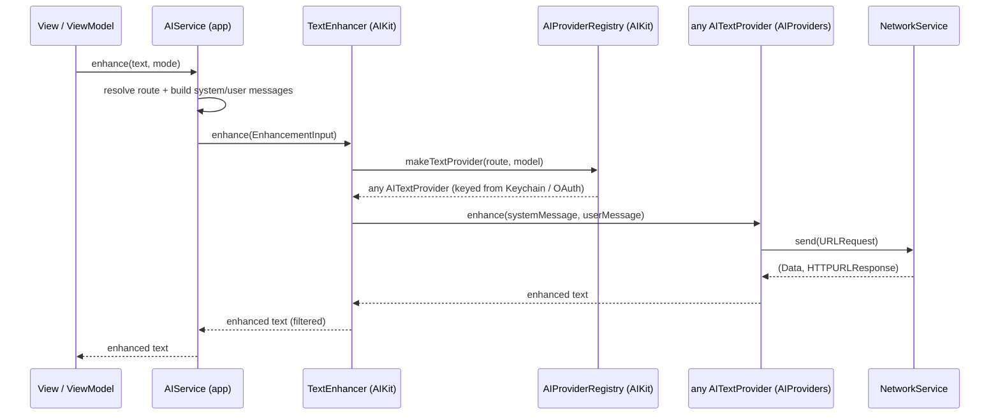
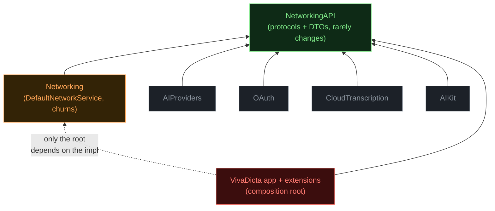
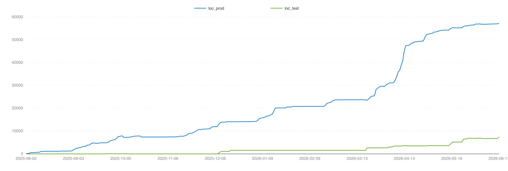

# Module Architecture

## Overview

VivaDicta is one app target plus a ring of local Swift Package modules under `Modules/`. The modules follow an **layers**: dependencies point inward only, and each layer composes the layers inside it.

- **Core** — no dependencies on other app modules; pure protocols + value types (and small kernels).
- **Adapter** — a single concern behind a protocol, with a `Default*` impl and a `Mock*` test double.
- **Orchestrator** — composes multiple adapters behind a higher-level seam.
- **App / extensions** — the composition root(s): the only place concrete `Default*` impls are constructed and wired against protocols.

The transcription stack (`TranscriptionCore` / `CloudTranscription` / `LocalTranscription` / `TranscriptionKit`) and the AI stack (`AICore` / `AIProviders` / `AIKit`) are the two reference shapes - same pattern, two domains.

## Layered view

Each layer composes the layers inside it; dependencies point inward only (app → orchestrators → adapters → core). The arrows are conceptual band-to-band; the concrete edges are in the dependency graph below.

## Module dependency graph

```mermaid
graph BT
  classDef core fill:#0e2a16,stroke:#7ee787,color:#7ee787
  classDef adapter fill:#332306,stroke:#ffa657,color:#ffa657
  classDef orchestrator fill:#3b0e26,stroke:#f778ba,color:#f778ba
  classDef app fill:#3b0d0d,stroke:#ff7b72,color:#ff7b72
  classDef external fill:#1c2128,stroke:#8b949e,color:#8b949e

  %% Core
  Networking[Networking]:::core
  Keychain[Keychain]:::core
  Presets[Presets]:::core
  TranscriptionCore[TranscriptionCore]:::core
  AICore[AICore]:::core
  AudioRecording[AudioRecording]:::core
  AppGroup[AppGroup]:::core
  Analytics[Analytics]:::core
  TextProcessing[TextProcessing]:::core
  DesignSystem[DesignSystem]:::core
  TestUtilities[TestUtilities]:::core

  %% Adapters
  OAuth[OAuth]:::adapter
  CloudTranscription[CloudTranscription]:::adapter
  LocalTranscription[LocalTranscription]:::adapter
  AIProviders[AIProviders]:::adapter

  %% Orchestrators
  TranscriptionKit[TranscriptionKit]:::orchestrator
  AIKit[AIKit]:::orchestrator

  %% App
  VivaDicta[VivaDicta app + extensions]:::app

  %% External
  WhisperKit[WhisperKit / FluidAudio]:::external

  %% Adapter -> Core
  OAuth --> Keychain
  OAuth --> Networking
  CloudTranscription --> TranscriptionCore
  CloudTranscription --> Networking
  LocalTranscription --> TranscriptionCore
  LocalTranscription --> WhisperKit
  AIProviders --> AICore
  AIProviders --> Networking

  %% Orchestrator -> Adapter + Core
  TranscriptionKit --> TranscriptionCore
  TranscriptionKit --> CloudTranscription
  TranscriptionKit --> LocalTranscription
  TranscriptionKit --> Networking
  AIKit --> AICore
  AIKit --> AIProviders
  AIKit --> Keychain
  AIKit --> OAuth
  AIKit --> Networking

  %% App -> everything it composes
  VivaDicta --> TranscriptionKit
  VivaDicta --> AIKit
  VivaDicta --> CloudTranscription
  VivaDicta --> LocalTranscription
  VivaDicta --> OAuth
  VivaDicta --> AIProviders
  VivaDicta --> TranscriptionCore
  VivaDicta --> AICore
  VivaDicta --> Keychain
  VivaDicta --> Networking
  VivaDicta --> Presets
  VivaDicta --> AudioRecording
  VivaDicta --> AppGroup
  VivaDicta --> Analytics
  VivaDicta --> TextProcessing
  VivaDicta --> DesignSystem
```

Solid arrow = production code dependency. `<Module>Mocks` targets always depend on their own `<Module>` + `TestUtilities` and are omitted from the graph below for clarity.

**Note on "core":** the green layer means *no module dependencies* - a graph property. It spans two different *roles*: **generic infrastructure** (`Networking`, `Keychain`, `DesignSystem`, `AppGroup`) and **domain API kernels** (`AICore`, `TranscriptionCore`, `Presets` - the protocol + value-type kernel of a domain). Same dependency level, different roles.

## Module catalogue

| Module | Layer | Purpose | Mock |
|---|---|---|---|
| `TestUtilities` | core | `Result.evaluate()` + `StubNotSetError`; shared scaffolding every `*Mocks` target uses. | n/a |
| `Networking` | core | `NetworkService` protocol + `DefaultNetworkService` impl + `NetworkError`. | `MockNetworkService` |
| `Keychain` | core | `KeychainService` protocol + `DefaultKeychainService`. | `MockKeychainService` |
| `Presets` | core | Preset domain types + management (Regular, Summary, ...). | `PresetsMocks` |
| `TranscriptionCore` | core | Pure protocol + value types: `TranscriptionService`, `TranscriptionServiceResult`. | n/a |
| `AICore` | core | AI-stack API + kernel (Foundation only): `AITextProvider` protocol, `AIProvider` id enum, `EnhancementError`, `AIEnhancementOutputFilter`, `ReasoningConfig`, Apple FM sampling types. | n/a |
| `Analytics` | core | `AnalyticsService` protocol + `AnalyticsEvent` catalogue (stable Firebase event names/params). Pure Foundation, no deps. `DefaultAnalyticsService` (Firebase) stays app-side. | `AnalyticsMocks` |
| `TextProcessing` | core | Pure text transforms: `TextFormatter` (paragraph chunking), `TranscriptionOutputFilter` (filler/hallucination strip, `hasMeaningfulContent`, trailing-period strip), `LanguageDetector`. Foundation + NaturalLanguage, no deps. | n/a |
| `AppGroup` | core | App-Group coordination keys shared between the app and extensions. | n/a |
| `DesignSystem` | core | SwiftUI design tokens, colors, typography, shared components. | n/a |
| `AudioRecording` | core | `AudioRecordingService` + `AudioFileService` protocols + `Default*` impls. | `MockAudioRecordingService`, `MockAudioFileService` |
| `OAuth` | adapter | `OAuthManager` + `CopilotOAuthManager` protocols + `Default*` impls (PKCE / device-code). Depends on `Keychain` + `Networking`. | `MockOAuthManager`, `MockCopilotOAuthManager` |
| `CloudTranscription` | adapter | Per-provider speech-to-text services conforming to `TranscriptionService`. Depends on `TranscriptionCore` + `Networking`. | `MockTranscriptionService` |
| `LocalTranscription` | adapter | On-device transcription (WhisperKit + Parakeet/FluidAudio). | `LocalTranscriptionMocks` |
| `AIProviders` | adapter | Per-LLM text clients (Anthropic, OpenAI-compatible cluster, Ollama, Custom, Apple FM, OAuth clients) + thin `AITextProvider` wrappers. Depends on `AICore` + `Networking`. | (own tests) |
| `TranscriptionKit` | orchestrator | Routes a transcription request to cloud vs. local behind `TranscriptionCore`'s protocol. | `TranscriptionKitMocks` |
| `AIKit` | orchestrator | `AIProviderRegistry` (route + model → configured `any AITextProvider`), `TextEnhancer` (cloud/CLI/OAuth routing + fallback), `CLIServerEnhancer` seam. Depends on `AICore` + `AIProviders` + `Keychain` + `OAuth` + `Networking`. | `MockCLIServerEnhancer` |
| `VivaDicta` (app) | app | Views, SwiftData, view models, `AIService` (resolves routes + builds messages, delegates execution to `AIKit`), App Intents, extensions. | n/a |

## Rules the structure enforces

1. **Dependencies point inward only.** Core never imports adapters; adapters never import orchestrators; orchestrators never import the app target.
2. **No module imports another module's `Mocks` target.** Production code imports `<Module>`; tests import `<Module>Mocks`. Mock libraries are never an app-runtime dependency.
3. **Consumers depend on protocols, not concrete impls** - `any NetworkService`, `any OAuthManager`, `any TranscriptionService`, `any AITextProvider`, `any CLIServerEnhancer`. Production wires `Default<Name>`; tests wire `Mock<Name>`.
4. **One mock per seam.** A mock lives with the protocol it conforms to, not with the consumer.

## How an AI enhancement flows

`AIService` keeps the app-state-dependent parts (route resolution from sign-in flags, message building from modes / vocabulary / clipboard / Chinese-script prefs, Apple FM and Ollama/Custom request building). The CLI-server fallback is reached through the `CLIServerEnhancer` seam so it stays testable.

## Forward direction: physical API/Impl split

Today the protocol-and-impl pairs (`NetworkService` + `DefaultNetworkService`, etc.) live in **one target**, which gives logical dependency inversion (inject a mock, swap impls) but **no compile isolation** - `import Networking` still pulls in the impl, so an impl change recompiles every consumer.

The next phase introduces a **physical** split using SPM's per-target compilation boundary: one package vends two library products - `NetworkingAPI` (protocols + DTOs, rarely changes) and `Networking` (impl, depends on `NetworkingAPI`). Consumers import only `NetworkingAPI`; the impl change no longer cascades. Rules:

- The API target depends on nothing impl-side.
- Impl → API is the only edge between them.
- Every consumer imports only `<Module>API`.
- The **composition root** (the app `@main` / an `AppDependencies`, and each extension's entry - each executable target is its own process and its own root) is the only thing that depends on the impl product; it constructs `Default<Name>` and injects it as `any <Name>`.

This also means **retiring the `networkService: any NetworkService = DefaultNetworkService(...)` default-parameter idiom** - the impl is named only at the composition root, never as a consumer's default. Rolled out by cascade value (`Networking` first), each as its own behavior-preserving PR.

## Codebase size

Production vs. test Swift LOC over the project's git history (non-blank, non-line-comment lines; `*Tests` / `TestUtilities` count as test). The modular structure above is what keeps this ~58k-line production codebase navigable.

